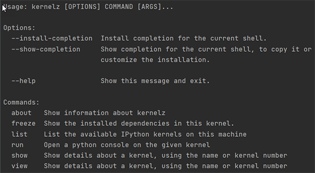

# Kernelz

**kernelz** is a tool for viewing and managing conda kernels

## Installing

```bash
pip install -U --user git+https://github.com/dgunning/kernelz.git
```
## Using Kkernels
**kernelz** is meant to provide information about the kernels that are on your system.

 To see the list of available commands type the following

```bash
python -m kernelz
```


### Listing kernels

To list the kernels which are installed on your system use the command `list`

```bash
python -m kernelz list
```

### Viewing a kernel 
You can view details on a specific kernel, including its location using the commands `show` or `view`.
These are synonyms of each other.

```bash
python -m kernels show <kernel>
```
.. using `view`
```bash
python -m kernels view <kernel>
```

### Showing installed dependencies
You can see the libraries installed in a kernel using the command `freeze`. This produces the output of `pip freeze`.
``bash
python -m kernels freeze <kernel>
``
### Help
To get help use the following command
```bash
python kernelz --help